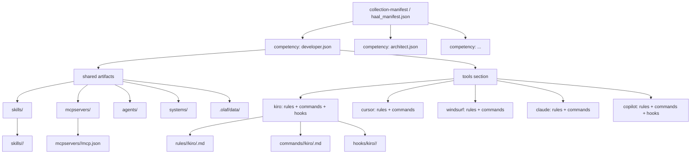
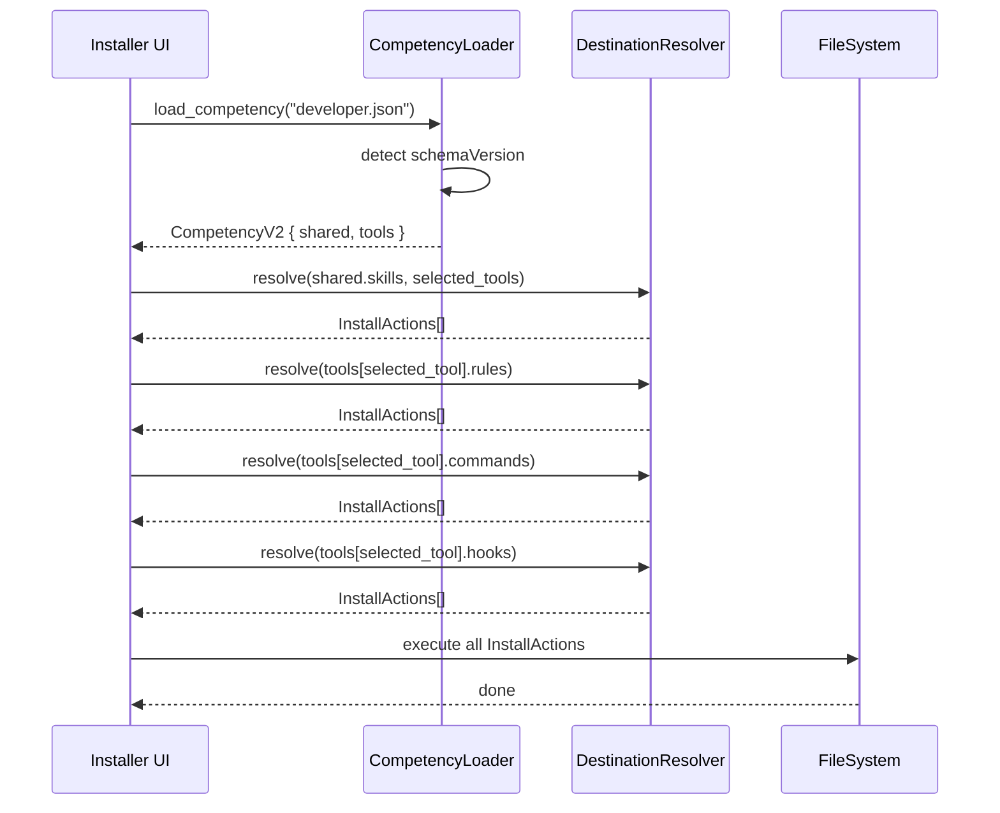
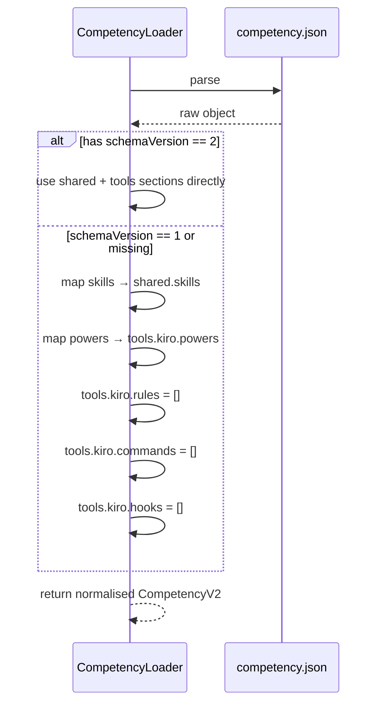

# Design Document: Registry Competency Redesign

## Overview

The haal-skills registry currently uses a flat competency model that only groups skills and powers — it has no concept of tool-specific artifacts (rules, commands, hooks) and no way to express per-tool variation within a competency. This redesign introduces a structured competency format with a `shared` section for tool-agnostic artifacts and a `tools` section for per-tool bundles, while keeping the registry folder structure flat and avoiding a separate `packages/` layer.

The change touches three surfaces: the competency JSON schema, the registry folder layout (adding `rules/`, `commands/`, `hooks/` top-level folders), and the installer's competency loader in `destination_resolver.rs`. Existing competencies remain valid through a backward-compatible migration path.

## Architecture



## Registry Folder Layout

The new top-level structure adds `rules/`, `commands/`, and `hooks/` folders alongside the existing ones. The `powers/` folder is retained for backward compatibility but is deprecated in favour of expressing Kiro-specific rules/commands inside the `tools.kiro` section of a competency.

```
haal-skills/
  skills/<id>/skill.md                          # tool-agnostic (unchanged)
  powers/<id>/                                  # Kiro-only, deprecated but kept
  mcpservers/<id>/mcp.json                      # tool-agnostic (unchanged)
  agents/<subfolder>/<id>/                      # tool-specific (unchanged)
  rules/<scope>/<tool>/<id>/filename.md         # NEW — tool-specific rules
  commands/<scope>/<tool>/<id>/filename.md      # NEW — tool-specific commands
  hooks/<tool>/<id>/hook.json                   # NEW — tool-specific hooks
  competencies/<id>.json                        # updated schema (see below)
  collection-manifest.json                      # unchanged
  haal_manifest.json                            # schema version bump
```

`<scope>` is `global` or `repo`. `<tool>` is `kiro`, `cursor`, `windsurf`, `claude`, or `copilot`.

## New Competency JSON Schema

### Full format

```json
{
  "name": "developer",
  "description": "Developer: code review, analysis, refactoring, and quality improvement",
  "schemaVersion": 2,
  "shared": {
    "skills":     ["review-code", "fix-code-smells", "augment-code-unit-test"],
    "mcpservers": ["github-mcp"],
    "agents":     [],
    "systems":    [],
    "olafdata":   []
  },
  "tools": {
    "kiro": {
      "powers":   ["code-in-go", "code-in-rust"],
      "rules":    ["rules/repo/kiro/developer-guidelines"],
      "commands": ["commands/repo/kiro/review-pr"],
      "hooks":    ["hooks/kiro/on-save-lint"]
    },
    "cursor": {
      "rules":    ["rules/repo/cursor/developer-guidelines"],
      "commands": ["commands/repo/cursor/review-pr"]
    },
    "windsurf": {
      "rules":    ["rules/repo/windsurf/developer-guidelines"],
      "commands": ["commands/repo/windsurf/review-pr"]
    },
    "claude": {
      "rules":    ["rules/repo/claude/developer-guidelines"],
      "commands": ["commands/repo/claude/review-pr"]
    },
    "copilot": {
      "rules":    ["rules/repo/copilot/developer-guidelines"],
      "commands": ["commands/repo/copilot/review-pr"],
      "hooks":    ["hooks/copilot/on-save-lint"]
    }
  }
}
```

### Field semantics

| Field | Type | Description |
|---|---|---|
| `schemaVersion` | integer | `1` = legacy format, `2` = new format. Omitted → treated as `1`. |
| `shared.skills` | string[] | Skill IDs — installed for all selected tools |
| `shared.mcpservers` | string[] | MCP server IDs — merged into each tool's config |
| `shared.agents` | string[] | Agent IDs — installed for all selected tools |
| `shared.systems` | string[] | System IDs — cloned globally |
| `shared.olafdata` | string[] | OLAF data subfolder IDs — repo-scoped |
| `tools.<tool>.powers` | string[] | Kiro-only; powers installed globally |
| `tools.<tool>.rules` | string[] | Registry paths to rule files/folders |
| `tools.<tool>.commands` | string[] | Registry paths to command files/folders |
| `tools.<tool>.hooks` | string[] | Registry paths to hook folders |

All arrays are optional and default to `[]`.

### Backward compatibility — legacy format (schemaVersion 1)

Existing competencies with top-level `skills` and `powers` arrays continue to work. The installer detects the absence of `schemaVersion` (or `schemaVersion: 1`) and maps them as:

```
legacy.skills  → shared.skills
legacy.powers  → tools.kiro.powers
```

No migration of existing files is required at launch.

## Sequence Diagrams

### Install flow — new competency format



### Migration detection flow



## Components and Interfaces

### CompetencyLoader

**Purpose**: Parse and normalise competency JSON files into a unified internal representation regardless of schema version.

**Interface**:
```typescript
interface CompetencyShared {
  skills:     string[]
  mcpservers: string[]
  agents:     string[]
  systems:    string[]
  olafdata:   string[]
}

interface CompetencyToolBundle {
  powers?:   string[]   // kiro only
  rules:     string[]
  commands:  string[]
  hooks:     string[]
}

interface CompetencyV2 {
  name:          string
  description:   string
  schemaVersion: 1 | 2
  shared:        CompetencyShared
  tools:         Partial<Record<ToolId, CompetencyToolBundle>>
}

type ToolId = "kiro" | "cursor" | "windsurf" | "claude" | "copilot"

function loadCompetency(path: string): CompetencyV2
function normaliseLegacy(raw: LegacyCompetency): CompetencyV2
```

**Responsibilities**:
- Read and parse competency JSON
- Detect schema version
- Normalise legacy format to `CompetencyV2`
- Validate required fields; surface clear errors for malformed files

### DestinationResolver (updated)

**Purpose**: Resolve registry artifact paths to install destinations. Extended to handle rules, commands, and hooks referenced from competency `tools` sections.

**New resolution paths**:
```typescript
// rules/<scope>/<tool>/<id>/filename.md
function resolveRule(comp: ResolvedComponent): InstallAction[]

// commands/<scope>/<tool>/<id>/filename.md  
function resolveCommand(comp: ResolvedComponent): InstallAction[]

// hooks/<tool>/<id>/hook.json
function resolveHook(comp: ResolvedComponent): InstallAction[]
```

The existing `resolve_rule`, `resolve_command`, and `resolve_hook` functions already handle these paths — no new routing logic is needed. The change is upstream: the competency loader now emits these artifact IDs into the resolution pipeline.

### haal_manifest.json (updated)

Add a `schemaVersion` field at the top level and document the new competency format:

```json
{
  "version": "2.0",
  "competencySchemaVersion": 2,
  "repoId": "haal-skills",
  ...
}
```

## Data Models

### CompetencyV2 (canonical internal model)

```typescript
interface CompetencyV2 {
  name:          string          // non-empty
  description:   string          // non-empty
  schemaVersion: 1 | 2
  shared: {
    skills:     string[]         // skill IDs
    mcpservers: string[]         // mcp server IDs
    agents:     string[]         // agent IDs
    systems:    string[]         // system IDs
    olafdata:   string[]         // olaf data subfolder IDs
  }
  tools: {
    [tool in ToolId]?: {
      powers?:  string[]         // kiro only
      rules:    string[]         // registry paths
      commands: string[]         // registry paths
      hooks:    string[]         // registry paths
    }
  }
}
```

**Validation rules**:
- `name` and `description` must be non-empty strings
- `schemaVersion` must be `1` or `2` (or absent, treated as `1`)
- All ID arrays must contain non-empty strings
- `powers` is only valid under `tools.kiro`; presence under other tools is a warning, not an error
- Unknown tool keys under `tools` are silently ignored (forward compatibility)

### Legacy format (schemaVersion 1)

```typescript
interface LegacyCompetency {
  name:        string
  description: string
  skills?:     string[]
  powers?:     string[]
}
```

## Error Handling

### Unknown artifact ID in competency

**Condition**: A skill/rule/command/hook ID referenced in a competency does not exist in the registry.  
**Response**: Log a warning with the competency name and missing ID. Skip the artifact. Do not abort the install.  
**Recovery**: User sees a warning summary after install; remaining artifacts are installed normally.

### Malformed competency JSON

**Condition**: JSON parse error or missing required fields (`name`, `description`).  
**Response**: Surface a clear error message identifying the file. Skip the entire competency.  
**Recovery**: Other competencies in the same collection continue to install.

### Mixed schema versions in a collection

**Condition**: A collection references both v1 and v2 competencies.  
**Response**: Each competency is normalised independently. No error.  
**Recovery**: Transparent — the normalisation layer handles both.

### Tool not selected but referenced in `tools`

**Condition**: A competency has `tools.cursor` entries but the user did not select Cursor.  
**Response**: The `tools.cursor` section is silently skipped.  
**Recovery**: Only selected tools' bundles are resolved.

## Testing Strategy

### Unit Testing Approach

- `CompetencyLoader`: test normalisation of legacy format, v2 format, missing optional fields, malformed JSON
- `DestinationResolver`: existing tests cover rule/command/hook resolution; add tests for competency-driven resolution (shared artifacts + per-tool bundles)
- Schema validation: test each validation rule with valid and invalid inputs

### Property-Based Testing Approach

**Property Test Library**: `proptest` (Rust)

Key properties:
- For any valid v1 competency, `normaliseLegacy(c).shared.skills == c.skills` **Validates: Requirements 4.2, 4.5**
- For any valid v1 competency, `normaliseLegacy(c).tools.kiro.powers == c.powers` **Validates: Requirements 4.3, 4.6**
- For any v2 competency, round-trip serialisation produces an equivalent object **Validates: Requirements 1.1, 3.1**
- For any competency, installing with no tools selected produces zero tool-specific install actions **Validates: Requirements 5.4**
- For any competency, install actions for tool T are a subset of install actions for all tools **Validates: Requirements 8.1, 8.2**
- For any registry path containing `..`, the DestinationResolver rejects it **Validates: Requirements 6.1, 6.2, 6.3**
- For any competency with unknown artifact IDs, resolution continues and emits one warning per missing ID **Validates: Requirements 5.7, 5.8**

### Integration Testing Approach

- End-to-end: load a v2 competency, resolve all artifacts for a given tool selection, verify the resulting `InstallAction` list matches expected destinations
- Migration: load all existing competency files, verify they normalise without error

## Performance Considerations

Competency files are small JSON documents (< 5 KB each). Loading and normalising all competencies at startup is negligible. No caching layer is needed. The resolution pipeline is unchanged — adding more artifact types per competency increases the number of `InstallAction` items linearly, which is acceptable.

## Security Considerations

- Registry paths in `tools.<tool>.rules/commands/hooks` are resolved relative to the registry root. The installer must reject any path containing `..` to prevent path traversal.
- Competency files are fetched from a trusted registry URL (same trust model as today). No change to the trust boundary.

## Migration Path

1. **Phase 1 (this spec)**: Implement `CompetencyV2` schema and normalisation. Existing v1 competencies continue to work unchanged.
2. **Phase 2**: Migrate existing competencies to v2 format one by one, adding `shared`/`tools` sections. No flag day required.
3. **Phase 3** (future): Deprecate `powers` top-level key in v1 format; emit a deprecation warning when encountered.

## Dependencies

- `serde_json` (already used) — JSON parsing in Rust
- `proptest` (optional, for property tests) — Rust property-based testing
- No new external dependencies required
